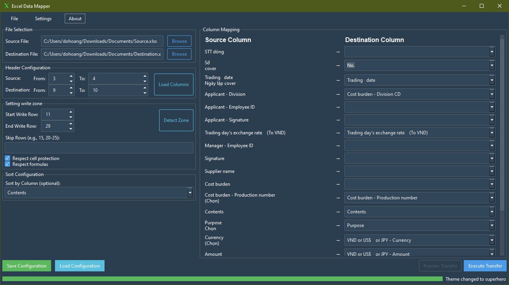

# Excel Data Mapper

A powerful application to map and transfer data between Excel files while preserving formatting and styles.

<!-- Add a screenshot of the application's UI here -->


---

## ✨ Key Features

- **Flexible Column Mapping**: Automatically suggests and allows manual mapping between source and destination columns.
- **Preserve Formatting**: Fully maintains the format, style, color, and borders of the destination Excel file.
- **Advanced Write Zone Control**: Precisely define where data should be written, what rows to skip, and what to protect.
- **Merged Cell Handling**: Intelligently supports reading from and writing to merged cells.
- **Data Sorting**: Allows sorting data by a specified column before the transfer.
- **Save/Load Configuration**: Saves all settings, including advanced ones, to a JSON file for reuse.
- **User-Friendly Interface**: Uses ttkbootstrap with switchable light/dark themes and a responsive two-column layout.
- **Comprehensive Error Handling**: Provides clear error messages and automatic backups for the destination file.
- **Robust File Handle Management**: Detects and warns if a file is locked by another program.

## 📂 Project Structure
```
ExcelMapper/

├── app.py                  # Main application entry point, contains GUI logic
├── setup.py                # Build script for creating the executable
├── ExcelDataMapper.spec    # PyInstaller specification file for the build
├── requirements.txt        # Python dependencies
├── icon.ico                # Application icon
├── README.md               # This file
├── configs/                # Directory for configuration files
│   └── app_settings.json
├── gui/                    # GUI-related modules (custom widgets)
│   └── widgets.py
└── logic/                  # Core business logic
    ├── config_manager.py   # Handles loading/saving configurations
    ├── mapper.py           # Logic for suggesting column mappings
    ├── parser.py           # Handles reading and parsing Excel files
    └── transfer.py         # Engine for the data transfer process
```

## 🚀 Installation and Execution

### System Requirements
- Windows 10 or later
- Python 3.9+
- Microsoft Office is not required

### Method 1: Run from Source Code

1.  **Clone the repository:**
    ```bash
    git clone <repository-url>
    cd ExcelMapper
    ```

2.  **Install dependencies:**
    ```bash
    pip install -r requirements.txt
    ```

3.  **Run the application:**
    ```bash
    python app.py
    ```

### Method 2: Build the Executable (.exe)

This project can be built in two ways:

- **One-Dir (Default)**: Creates a folder containing the executable and all its dependencies. This is the recommended method.
- **One-File**: Creates a single, standalone executable file. This may have a slower startup time.

1.  **To build a directory (default):**
    ```bash
    python setup.py build_binary
    ```
    The application will be located at `dist/ExcelDataMapper/ExcelDataMapper.exe`.

2.  **To build a single file:**
    ```bash
    python setup.py build_binary --onefile
    ```
    The executable will be created at `dist/ExcelDataMapper.exe`.

## 📖 User Guide

### Step 1: Select Files
- **Source File**: Choose the Excel file containing the data you want to transfer.
- **Destination File**: Choose the Excel template file you want to populate.

### Step 2: Configure Headers
This step tells the application where the headers are located in each file.
- **Source Header Rows**: The row(s) containing the headers in the source file.
- **Destination Header Rows**: The row(s) containing the headers in the destination file.
- Press **"Load Columns"** after configuring to have the application read and display the columns.

**ASCII Art Example:**

Assume your **Source** file has a simple header on the first row:
```
Source File (source.xlsx)
+---+--------------+----------+------------+
|   |      A       |    B     |     C      |
+---+--------------+----------+------------+
| 1 |  Employee ID  |  Amount  |    Date   |  <-- Header is on row 1
+---+--------------+----------+------------+
| 2 |    NV001     |   5000   | 2025-07-30 |
+---+--------------+----------+------------+
```
=> Configuration: `Source Header Rows: From [1] To [1]`

Assume your **Destination** file has a hierarchical header with merged cells:
```
Destination File (template.xlsx)
... (rows above are ignored)
+---+--------------------------------------------+--------------------------------------------+
|   |                 C & D                      |                 E & F                      |
+---+--------------------------------------------+--------------------------------------------+
| 9 |      EMPLOYEE INFORMATION (Merged)         |        PAYMENT DETAILS (Merged)            |  <-- Header starts on row 9 (Main)
+---+--------------------------------------------+--------------------------------------------+
| 10|       Emp. ID       |      Full Name       |        Amount       |         VAT          |  <-- Header ends on row 10 (Sub)
+---+---------------------+----------------------+---------------------+----------------------+
| 11| (data will go here) | (data will go here)  | (data will go here) | (data will go here)  |
+---+---------------------+----------------------+---------------------+----------------------+
```
=> Configuration: `Destination Header Rows: From [9] To [10]`
The application will correctly read the headers as "EMPLOYEE INFORMATION - Emp. ID", "PAYMENT DETAILS - Amount", etc.

### Step 3: Map Columns
- After loading, the app will display columns from the source file on the left and from the destination file on the right.
- The system will automatically suggest mappings. You can change these suggestions using the dropdown menu for each source column.

### Step 4: Advanced Write Zone Control (New!)
This new panel gives you precise control over the writing process in the destination file.

- **Start Write Row**: The first row where data writing/clearing will begin. This must be after the destination header rows.
- **End Write Row**: The last row that can be written to. If set to `0`, there is no limit. The transfer will stop if it reaches this row.
- **Skip Rows**: Specify rows or ranges to be completely ignored. The application will not write to or clear these rows. Data that was supposed to go into a skipped row will be moved to the next available valid row.
  - **Format**: Comma-separated numbers or ranges.
  - **Example**: `15, 22, 30-35` will skip row 15, row 22, and all rows from 30 to 35.
- **Respect cell protection**: (Default: On) If checked, the application will not write to any row that contains locked cells (if the sheet itself is protected). This is treated like a "skip" rule.
- **Respect formulas**: (Default: On) If checked, the application will not write to any cell that contains a formula.

### Step 5: Configure Sorting (Optional)
- In the "Sort Configuration" section, you can select a column from the **source** file to sort the data before it's written.

### Step 6: Save/Load Configuration
- **Save Configuration**: Saves all current settings (file paths, headers, mappings, write zone rules) to a `.json` file.
- **Load Configuration**: Loads a previously saved configuration file.

### Step 7: Execute
- Press **"Execute Transfer"** to start the data transfer process.
- A progress bar will show the status. On success, a notification will appear.

## 🔧 Troubleshooting

### Common Errors

1.  **"Could not load columns"**
    -   **Primary Cause**: The header row configuration (Step 2) is incorrect. Double-check your Excel files.
    -   Verify the file paths.
    -   Ensure the file is not locked (open in Microsoft Excel).

2.  **"Start Write Row must be after the destination header rows."**
    -   In the "Setting write zone" panel, the `Start Write Row` must be a number greater than the `To` value of the `Destination Header Rows`.

3.  **"Duplicate destination columns detected"**
    -   You have mapped multiple source columns to the same destination column.

### Log File
All operations and errors are logged to the `app.log` file in the same directory as the application.

---
<br>

# (Tiếng Việt) Excel Data Mapper

Một ứng dụng mạnh mẽ để ánh xạ và chuyển dữ liệu giữa các file Excel trong khi vẫn giữ nguyên định dạng và style.

<!-- Thêm ảnh chụp màn hình giao diện ứng dụng tại đây -->
<!--  -->

## ✨ Tính năng chính

- **Ánh xạ cột linh hoạt**: Tự động gợi ý và cho phép ánh xạ thủ công giữa cột nguồn và đích.
- **Giữ nguyên định dạng**: Bảo toàn hoàn toàn format, style, màu sắc, viền của file Excel đích.
- **Kiểm soát vùng ghi nâng cao**: Định nghĩa chính xác nơi dữ liệu sẽ được ghi, các hàng cần bỏ qua, và những gì cần bảo vệ.
- **Xử lý merge cells**: Hỗ trợ đọc và ghi dữ liệu vào các ô đã được merge một cách thông minh.
- **Sắp xếp dữ liệu**: Cho phép sắp xếp dữ liệu theo cột được chỉ định trước khi chuyển.
- **Lưu/Tải cấu hình**: Lưu lại toàn bộ cài đặt, bao gồm cả các tùy chọn nâng cao, vào file JSON để tái sử dụng.
- **Giao diện thân thiện**: Sử dụng ttkbootstrap với 2 theme (sáng/tối) có thể chuyển đổi và bố cục hai cột linh hoạt.
- **Xử lý lỗi toàn diện**: Báo lỗi rõ ràng và có backup tự động cho file đích.
- **Quản lý File Handle mạnh mẽ**: Phát hiện và cảnh báo nếu file đang bị khóa bởi chương trình khác.

## 📂 Cấu trúc dự án
```
ExcelMapper/

├── app.py                  # File chính của ứng dụng, chứa logic giao diện
├── setup.py                # Script để build ra file thực thi
├── ExcelDataMapper.spec    # File cấu hình cho PyInstaller để build
├── requirements.txt        # Các thư viện Python cần thiết
├── icon.ico                # Icon của ứng dụng
├── README.md               # Chính là file này
├── configs/                # Thư mục chứa các file cấu hình
│   └── app_settings.json
├── gui/                    # Các module liên quan đến giao diện (widget tùy chỉnh)
│   └── widgets.py
└── logic/                  # Nơi chứa logic nghiệp vụ cốt lõi
    ├── config_manager.py   # Xử lý lưu/tải cấu hình
    ├── mapper.py           # Logic gợi ý ánh xạ cột
    ├── parser.py           # Xử lý đọc và phân tích file Excel
    └── transfer.py         # "Động cơ" chính cho việc chuyển dữ liệu
```

## 🚀 Cài đặt và chạy

### Yêu cầu hệ thống
- Windows 10 trở lên
- Python 3.9+
- Không cần cài đặt Microsoft Office

### Cách 1: Chạy từ source code

1. **Clone repository:**
```bash
git clone <repository-url>
cd ExcelMapper
```

2. **Cài đặt dependencies:**
```bash
pip install -r requirements.txt
```

3. **Chạy ứng dụng:**
```bash
python app.py
```

### Cách 2: Build file thực thi (.exe)

Dự án có thể được build theo hai cách:

- **One-Dir (Mặc định)**: Tạo ra một thư mục chứa file thực thi và tất cả các tệp phụ thuộc. Đây là phương pháp được khuyến nghị.
- **One-File**: Tạo ra một file thực thi duy nhất, độc lập. Cách này có thể làm ứng dụng khởi động chậm hơn.

1.  **Để build ra một thư mục (mặc định):**
    ```bash
    python setup.py buid_binary
    ```
    Ứng dụng sẽ nằm tại `dist/ExcelDataMapper/ExcelDataMapper.exe`.

2.  **Để build ra một file duy nhất:**
    ```bash
    python setup.py build_binary --onefile
    ```
    File thực thi sẽ được tạo tại `dist/ExcelDataMapper.exe`.

## 📖 Hướng dẫn sử dụng

### Bước 1: Chọn File
- **Source File**: Chọn file Excel chứa dữ liệu bạn muốn chuyển đi.
- **Destination File**: Chọn file Excel mẫu (template) mà bạn muốn điền dữ liệu vào.

### Bước 2: Cấu hình Header
Đây là bước để chỉ cho ứng dụng biết đâu là dòng tiêu đề trong mỗi file.
- **Source Header Rows**: Các dòng chứa tiêu đề trong file nguồn.
- **Destination Header Rows**: Các dòng chứa tiêu đề trong file đích.
- Nhấn **"Load Columns"** sau khi cấu hình xong để ứng dụng đọc và hiển thị các cột.

**Ví dụ minh họa:**

Giả sử file **Source** của bạn có tiêu đề đơn giản ở dòng đầu tiên:
```
Source File (source.xlsx)
+---+--------------+----------+------------+
|   |      A       |    B     |     C      |
+---+--------------+----------+------------+
| 1 |  Mã nhân viên |  Số tiền |  Ngày chi |  <-- Header ở dòng 1
+---+--------------+----------+------------+
| 2 |    NV001     |   5000   | 2025-07-30 |
+---+--------------+----------+------------+
```
=> Cấu hình: `Source Header Rows: From [1] To [1]`

Giả sử file **Destination** của bạn có tiêu đề phân cấp với các ô được merge:
```
Destination File (template.xlsx)
... (các dòng trên bị bỏ qua)
+---+---------------------------------------------+---------------------------------------------+
|   |                 C & D                       |                 E & F                       |
+---+---------------------------------------------+---------------------------------------------+
| 9 |      THÔNG TIN NHÂN VIÊN (Merged)           |        CHI TIẾT THANH TOÁN (Merged)         |  <-- Header bắt đầu từ dòng 9 (Cấp chính)
+---+---------------------------------------------+---------------------------------------------+
| 10|       Mã NV          |       Họ và Tên      |        Số tiền       |         VAT          |  <-- Header kết thúc ở dòng 10 (Cấp phụ)
+---+----------------------+----------------------+----------------------+----------------------+
| 11| (dữ liệu sẽ vào đây) | (dữ liệu sẽ vào đây) | (dữ liệu sẽ vào đây) | (dữ liệu sẽ vào đây) |
+---+----------------------+----------------------+-----------------------+---------------------+
```
=> Cấu hình: `Destination Header Rows: From [9] To [10]`
Ứng dụng sẽ đọc chính xác các header thành "THÔNG TIN NHÂN VIÊN - Mã NV", "CHI TIẾT THANH TOÁN - Số tiền", v.v.

### Bước 3: Ánh xạ cột
- Sau khi tải, ứng dụng sẽ hiển thị các cột từ file nguồn bên trái và các cột từ file đích bên phải.
- Hệ thống sẽ tự động gợi ý ánh xạ. Bạn có thể thay đổi các gợi ý này bằng cách chọn từ danh sách dropdown cho mỗi cột nguồn.

### Bước 4: Kiểm soát vùng ghi nâng cao (Mới!)
Panel mới này cho phép bạn kiểm soát chính xác quá trình ghi dữ liệu vào file đích.

- **Start Write Row**: Dòng đầu tiên mà việc ghi/xóa dữ liệu sẽ bắt đầu. Dòng này phải nằm sau các dòng header của file đích.
- **End Write Row**: Dòng cuối cùng được phép ghi. Nếu đặt là `0`, sẽ không có giới hạn. Quá trình chuyển sẽ dừng lại nếu chạm đến dòng này.
- **Skip Rows**: Chỉ định các hàng hoặc khoảng hàng sẽ bị bỏ qua hoàn toàn. Ứng dụng sẽ không ghi hoặc xóa dữ liệu ở các hàng này. Dữ liệu dự kiến ghi vào một hàng bị bỏ qua sẽ được chuyển xuống hàng hợp lệ tiếp theo.
  - **Định dạng**: Các số hoặc khoảng số cách nhau bởi dấu phẩy.
  - **Ví dụ**: `15, 22, 30-35` sẽ bỏ qua dòng 15, dòng 22, và tất cả các dòng từ 30 đến 35.
- **Respect cell protection**: (Mặc định: Bật) Nếu được chọn, ứng dụng sẽ không ghi vào bất kỳ hàng nào có chứa ô bị khóa (khi sheet được bảo vệ). Quy tắc này được xử lý tương tự như một hàng trong "Skip Rows".
- **Respect formulas**: (Mặc định: Bật) Nếu được chọn, ứng dụng sẽ không ghi vào bất kỳ ô nào có chứa công thức.

### Bước 5: Cấu hình sắp xếp (Tùy chọn)
- Trong phần "Sort Configuration", bạn có thể chọn một cột từ file **nguồn** để sắp xếp dữ liệu trước khi ghi.

### Bước 6: Lưu/Tải cấu hình
- **Save Configuration**: Lưu lại toàn bộ cài đặt hiện tại (đường dẫn file, header, ánh xạ, quy tắc vùng ghi) ra một file `.json`.
- **Load Configuration**: Tải lại một file cấu hình đã lưu.

### Bước 7: Thực hiện
- Nhấn **"Execute Transfer"** để bắt đầu quá trình chuyển dữ liệu.
- Thanh tiến trình sẽ cập nhật trạng thái. Nếu thành công, một thông báo sẽ hiện ra.

## 🔧 Xử lý sự cố

### Lỗi thường gặp

1.  **"Could not load columns"**
    -   **Nguyên nhân chính**: Cấu hình dòng header (Bước 2) không chính xác. Hãy kiểm tra lại file Excel của bạn.
    -   Kiểm tra lại đường dẫn file.
    -   Đảm bảo file không bị khóa (đang mở trong Microsoft Excel).

2.  **"Start Write Row must be after the destination header rows."**
    -   Trong panel "Setting write zone", giá trị `Start Write Row` phải lớn hơn giá trị `To` của `Destination Header Rows`.

3.  **"Duplicate destination columns detected"**
    -   Bạn đã ánh xạ nhiều cột nguồn vào cùng một cột đích.

### Log file
Tất cả các hoạt động và lỗi đều được ghi vào file `app.log` trong cùng thư mục với ứng dụng.
