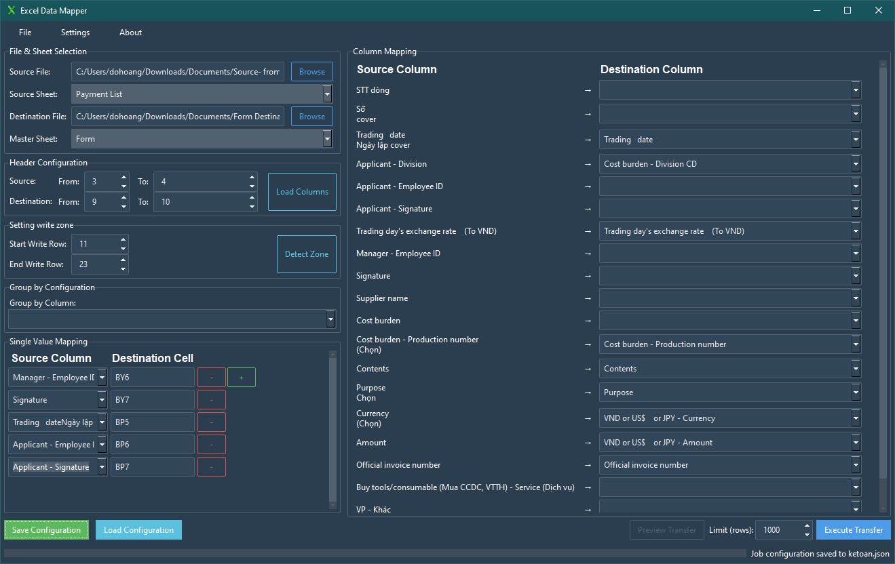

# Excel Data Mapper

A powerful application to intelligently transfer and group data between Excel files, creating new sheets from a master template while preserving all formatting and styles.

<!-- The screenshot is slightly outdated, UI has been improved. -->


---

## ✨ Key Features

- **Intelligent Template Reconstruction**: Instead of modifying your template, it generates a new output file where each data group becomes a new sheet, perfectly cloned from your master template.
- **Flexible Column Mapping**: Automatically suggests and allows manual mapping between source and destination columns.
- **Interactive Preview & Simulation**: A powerful multi-tab preview shows exactly how data will be grouped, what the output will look like, and flags potential data validation errors before you commit to the transfer.
- **Data Validation Checks**: The preview automatically checks source data against the destination template's `list`-type data validation rules to catch errors early.
- **Group Exclusion**: From the preview window, you can easily specify groups to exclude from the final transfer.
- **Partial Preview**: For huge source files, you can limit the preview to the first N rows for a near-instant simulation.
- **Safe by Design**: Your source and destination template files are **never modified**. All results are written to a new, separate output file.
- **Save/Load Configuration**: Saves all settings to a JSON file for one-click reuse of complex jobs.
- **User-Friendly Interface**: Uses ttkbootstrap with switchable light/dark themes.
- **Robust File Handle Management**: Detects and warns if a file is locked by another program.

## 📂 Project Structure
```
ExcelMapper/

├── app.py                  # Main application entry point, contains GUI logic
├── setup.py                # Build script for creating the executable
├── requirements.txt        # Python dependencies
├── icon.ico                # Application icon
├── README.md               # This file
├── configs/                # Directory for configuration files
│   └── app_settings.json
├── gui/                    # GUI-related modules (custom widgets)
│   └── widgets.py
└── logic/                  # Core business logic
    ├── config_manager.py   # Handles loading/saving configurations
    ├── mapper.py           # Logic for suggesting column mappings
    ├── parser.py           # Handles reading and parsing Excel files
    └── transfer.py         # Engine for the data transfer process
```

## 🚀 Installation and Execution

### System Requirements
- Windows 10 or later
- Python 3.9+
- Microsoft Office is not required

### Method 1: Run from Source Code

1.  **Clone the repository:**
    ```bash
    git clone <repository-url>
    cd ExcelMapper
    ```

2.  **Install dependencies:**
    ```bash
    pip install -r requirements.txt
    ```

3.  **Run the application:**
    ```bash
    python app.py
    ```

### Method 2: Build the Executable (.exe)

This project can be built in two ways:

- **One-Dir (Default)**: Creates a folder containing the executable and all its dependencies. This is the recommended method.
- **One-File**: Creates a single, standalone executable file. This may have a slower startup time.

1.  **To build a directory (default):**
    ```bash
    python setup.py build_binary
    ```
    The application will be located at `dist/ExcelDataMapper/ExcelDataMapper.exe`.

2.  **To build a single file:**
    ```bash
    python setup.py build_binary --onefile
    ```
    The executable will be created at `dist/ExcelDataMapper.exe`.

## 📖 User Guide

### Step 1: Select Files & Sheets
- **Source File**: Choose the Excel file containing the data you want to transfer.
- **Destination File**: Choose the Excel **template file** you want to use as a base for the new sheets.
- **Source Sheet / Master Sheet**: Select the correct sheet from each file.

### Step 2: Configure Headers
This step tells the application where the headers are located in each file.
- **Source Header Rows**: The row(s) containing the headers in the source file.
- **Destination Header Rows**: The row(s) containing the headers in the destination template file.
- Press **"Load Columns"** after configuring to have the application read and display the columns.

**ASCII Art Example:**

Assume your **Source** file has a simple header on the first row:
```
Source File (source.xlsx)
+---+--------------+----------+------------+
|   |      A       |    B     |     C      |
+---+--------------+----------+------------+
| 1 |  Employee ID  |  Amount  |    Date   |  <-- Header is on row 1
+---+--------------+----------+------------+
| 2 |    NV001     |   5000   | 2025-07-30 |
+---+--------------+----------+------------+
```
=> Configuration: `Source Header Rows: From [1] To [1]`

Assume your **Destination** file has a hierarchical header with merged cells:
```
Destination File (template.xlsx)
... (rows above are ignored)
+---+--------------------------------------------+--------------------------------------------+
|   |                 C & D                      |                 E & F                      |
+---+--------------------------------------------+--------------------------------------------+
| 9 |      EMPLOYEE INFORMATION (Merged)         |        PAYMENT DETAILS (Merged)            |  <-- Header starts on row 9 (Main)
+---+--------------------------------------------+--------------------------------------------+
| 10|       Emp. ID       |      Full Name       |        Amount       |         VAT          |  <-- Header ends on row 10 (Sub)
+---+---------------------+----------------------+---------------------+----------------------+
| 11| (data will go here) | (data will go here)  | (data will go here) | (data will go here)  |
+---+---------------------+----------------------+---------------------+----------------------+
```
=> Configuration: `Destination Header Rows: From [9] To [10]`

The application will correctly read the headers as "EMPLOYEE INFORMATION - Emp. ID", "PAYMENT DETAILS - Amount", etc.

### Step 3: Map Columns & Configure
- **Column Mapping**: Map the source columns to your desired destination columns. The system will suggest mappings which you can override.
- **Group by Configuration**: Select a column from the source file to group your data by. Each unique value in this column will result in a new sheet being created in the output file.
- **Single Value Mapping**: Map a value from a source column to a single, specific cell in the destination template (e.g., mapping a customer name to cell `C4`).

### Step 4: Define the Write Zone
The "Setting write zone" panel tells the application how to handle the data, header, and footer sections of your template.

- **Start Write Row**: The first row of the data area in your destination template.
- **End Write Row**: The last row of the data area in your destination template. This is a **critical setting**. It acts as a marker to tell the application where the "footer" (e.g., totals, signature lines) begins.

### Step 5: Preview & Execute
This is the recommended workflow.

1.  **Set Preview Limit (Optional)**: For large files, set a row limit (e.g., 1000) to get a fast preview.
2.  **Press "Preview Transfer"**: This opens the Simulation Report.
    -   **Summary**: Get an overview of the transfer.
    -   **Group Details**: See a full list of all groups that will be created.
    -   **Validation**: Check for potential conflicts between your source data and the destination sheet's data validation rules.
3.  **Exclude Groups (Optional)**: In the "Group Details" tab, you can specify any groups you don't want to transfer.
4.  **Press "Run Transfer"**: From the preview window, press "Run Transfer" to execute the process with your specified exclusions. A new file named `[Your-Destination-File]-output.xlsx` will be created.

Alternatively, you can press **"Execute Transfer"** from the main window to run the process on all data without a preview.

## 🔧 Troubleshooting

### Common Errors

1.  **"Could not load columns"**
    -   **Primary Cause**: The header row configuration (Step 2) is incorrect. Double-check your Excel files.
    -   Verify the file paths.
    -   Ensure the file is not locked (open in Microsoft Excel).

2.  **"Please select a 'Group by Column'"**
    -   This is a required field for the application to function.

3.  **"Duplicate destination columns detected"**
    -   You have mapped multiple source columns to the same destination column.

### Log File
All operations and errors are logged to the `app.log` file in the same directory as the application.

---
<br>

# (Tiếng Việt) Excel Data Mapper

Một ứng dụng mạnh mẽ để chuyển và nhóm dữ liệu giữa các file Excel một cách thông minh, tự động tạo các sheet mới từ một file mẫu (template) trong khi vẫn bảo toàn toàn bộ định dạng và style.

<!-- Ảnh chụp màn hình đã hơi cũ, giao diện đã được cải thiện. -->


## ✨ Tính năng chính

- **Tái cấu trúc Template thông minh**: Thay vì sửa file mẫu của bạn, ứng dụng sẽ tạo ra một file output mới, trong đó mỗi nhóm dữ liệu sẽ trở thành một sheet mới, được nhân bản hoàn hảo từ sheet master của bạn.
- **Ánh xạ cột linh hoạt**: Tự động gợi ý và cho phép ánh xạ thủ công giữa cột nguồn và đích.
- **Xem trước & Mô phỏng tương tác**: Cửa sổ xem trước đa tab mạnh mẽ cho thấy chính xác dữ liệu sẽ được nhóm như thế nào, kết quả sẽ ra sao, và cảnh báo các lỗi data validation tiềm tàng trước khi bạn thực hiện chuyển dữ liệu.
- **Kiểm tra Data Validation**: Tính năng xem trước tự động đối chiếu dữ liệu nguồn với các quy tắc data validation dạng `list` của file mẫu để phát hiện lỗi sớm.
- **Loại trừ Nhóm**: Từ cửa sổ xem trước, bạn có thể dễ dàng chỉ định các nhóm không muốn chuyển vào file kết quả.
- **Xem trước một phần**: Đối với các file nguồn khổng lồ, bạn có thể giới hạn xem trước trong N dòng đầu tiên để có kết quả mô phỏng gần như tức thì.
- **An toàn tuyệt đối**: File nguồn và file template của bạn **không bao giờ bị chỉnh sửa**. Mọi kết quả đều được ghi ra một file output mới và riêng biệt.
- **Lưu/Tải cấu hình**: Lưu lại toàn bộ cài đặt ra file JSON để tái sử dụng các tác vụ phức tạp chỉ bằng một cú nhấp chuột.
- **Giao diện thân thiện**: Sử dụng ttkbootstrap với 2 theme (sáng/tối) có thể chuyển đổi.
- **Quản lý File Handle mạnh mẽ**: Phát hiện và cảnh báo nếu file đang bị khóa bởi chương trình khác.

## 📂 Cấu trúc dự án
```
ExcelMapper/

├── app.py                  # File chính của ứng dụng, chứa logic giao diện
├── setup.py                # Script để build ra file thực thi
├── requirements.txt        # Các thư viện Python cần thiết
├── icon.ico                # Icon của ứng dụng
├── README.md               # Chính là file này
├── configs/                # Thư mục chứa các file cấu hình
│   └── app_settings.json
├── gui/                    # Các module liên quan đến giao diện (widget tùy chỉnh)
│   └── widgets.py
└── logic/                  # Nơi chứa logic nghiệp vụ cốt lõi
    ├── config_manager.py   # Xử lý lưu/tải cấu hình
    ├── mapper.py           # Logic gợi ý ánh xạ cột
    ├── parser.py           # Xử lý đọc và phân tích file Excel
    └── transfer.py         # "Động cơ" chính cho việc chuyển dữ liệu
```

## 🚀 Cài đặt và chạy

### Yêu cầu hệ thống
- Windows 10 trở lên
- Python 3.9+
- Không cần cài đặt Microsoft Office

### Cách 1: Chạy từ source code

1. **Clone repository:**
```bash
git clone <repository-url>
cd ExcelMapper
```

2. **Cài đặt dependencies:**
```bash
pip install -r requirements.txt
```

3. **Chạy ứng dụng:**
```bash
python app.py
```

### Cách 2: Build file thực thi (.exe)

Dự án có thể được build theo hai cách:

- **One-Dir (Mặc định)**: Tạo ra một thư mục chứa file thực thi và tất cả các tệp phụ thuộc. Đây là phương pháp được khuyến nghị.
- **One-File**: Tạo ra một file thực thi duy nhất, độc lập. Cách này có thể làm ứng dụng khởi động chậm hơn.

1.  **Để build ra một thư mục (mặc định):**
    ```bash
    python setup.py build_binary
    ```
    Ứng dụng sẽ nằm tại `dist/ExcelDataMapper/ExcelDataMapper.exe`.

2.  **Để build ra một file duy nhất:**
    ```bash
    python setup.py build_binary --onefile
    ```
    File thực thi sẽ được tạo tại `dist/ExcelDataMapper.exe`.

## 📖 Hướng dẫn sử dụng

### Bước 1: Chọn File & Sheet
- **Source File**: Chọn file Excel chứa dữ liệu bạn muốn chuyển đi.
- **Destination File**: Chọn file Excel **mẫu (template)** bạn muốn dùng làm cơ sở để tạo các sheet mới.
- **Source Sheet / Master Sheet**: Chọn sheet tương ứng từ mỗi file.

### Bước 2: Cấu hình Header
Đây là bước để chỉ cho ứng dụng biết đâu là dòng tiêu đề trong mỗi file.
- **Source Header Rows**: Các dòng chứa tiêu đề trong file nguồn.
- **Destination Header Rows**: Các dòng chứa tiêu đề trong file template đích.
- Nhấn **"Load Columns"** sau khi cấu hình xong để ứng dụng đọc và hiển thị các cột.

**Ví dụ minh họa:**

Giả sử file **Source** của bạn có tiêu đề đơn giản ở dòng đầu tiên:
```
Source File (source.xlsx)
+---+--------------+----------+------------+
|   |      A       |    B     |     C      |
+---+--------------+----------+------------+
| 1 |  Mã nhân viên |  Số tiền |  Ngày chi |  <-- Header ở dòng 1
+---+--------------+----------+------------+
| 2 |    NV001     |   5000   | 2025-07-30 |
+---+--------------+----------+------------+
```
=> Cấu hình: `Source Header Rows: From [1] To [1]`

Giả sử file **Destination** của bạn có tiêu đề phân cấp với các ô được merge:
```
Destination File (template.xlsx)
... (các dòng trên bị bỏ qua)
+---+---------------------------------------------+---------------------------------------------+
|   |                 C & D                       |                 E & F                       |
+---+---------------------------------------------+---------------------------------------------+
| 9 |      THÔNG TIN NHÂN VIÊN (Merged)           |        CHI TIẾT THANH TOÁN (Merged)         |  <-- Header bắt đầu từ dòng 9 (Cấp chính)
+---+---------------------------------------------+---------------------------------------------+
| 10|       Mã NV          |       Họ và Tên      |        Số tiền       |         VAT          |  <-- Header kết thúc ở dòng 10 (Cấp phụ)
+---+----------------------+----------------------+----------------------+----------------------+
| 11| (dữ liệu sẽ vào đây) | (dữ liệu sẽ vào đây) | (dữ liệu sẽ vào đây) | (dữ liệu sẽ vào đây) |
+---+----------------------+-----------------------+---------------------+---------------------+
```
=> Cấu hình: `Destination Header Rows: From [9] To [10]`

Ứng dụng sẽ đọc chính xác các header thành "THÔNG TIN NHÂN VIÊN - Mã NV", "CHI TIẾT THANH TOÁN - Số tiền", v.v.

### Bước 3: Ánh xạ cột & Cấu hình
- **Column Mapping**: Ánh xạ các cột nguồn tới các cột đích bạn mong muốn. Hệ thống sẽ gợi ý ánh xạ và bạn có thể thay đổi chúng.
- **Group by Configuration**: Chọn một cột từ file nguồn để nhóm dữ liệu. Mỗi giá trị duy nhất trong cột này sẽ tạo ra một sheet mới trong file kết quả.
- **Single Value Mapping**: Ánh xạ một giá trị từ cột nguồn vào một ô đơn lẻ, cụ thể trong file template (ví dụ: ánh xạ tên khách hàng vào ô `C4`).

### Bước 4: Định nghĩa Vùng Ghi (Write Zone)
Panel "Setting write zone" giúp ứng dụng hiểu cấu trúc các vùng dữ liệu, header, và footer trong file template của bạn.

- **Start Write Row**: Dòng đầu tiên của khu vực dữ liệu trong file template.
- **End Write Row**: Dòng cuối cùng của khu vực dữ liệu trong file template. Đây là một **cài đặt cực kỳ quan trọng**. Nó đóng vai trò như một "cột mốc" để báo cho ứng dụng biết đâu là điểm bắt đầu của phần "footer" (ví dụ: dòng tổng cộng, chữ ký).

### Bước 5: Xem trước & Thực thi
Đây là luồng làm việc được khuyến nghị.

1.  **Đặt giới hạn xem trước (Tùy chọn)**: Với các file lớn, hãy đặt giới hạn (ví dụ: 1000 dòng) để có một bản xem trước nhanh.
2.  **Nhấn "Preview Transfer"**: Cửa sổ Báo cáo Mô phỏng sẽ mở ra.
    -   **Summary**: Xem tổng quan về quá trình sẽ diễn ra.
    -   **Group Details**: Xem danh sách đầy đủ các nhóm sẽ được tạo.
    -   **Validation**: Kiểm tra các xung đột tiềm tàng giữa dữ liệu nguồn và quy tắc data validation của sheet đích.
3.  **Loại trừ Nhóm (Tùy chọn)**: Trong tab "Group Details", bạn có thể chỉ định các nhóm không muốn chuyển.
4.  **Nhấn "Run Transfer"**: Từ cửa sổ xem trước, nhấn nút này để thực hiện quá trình với các thiết lập loại trừ của bạn. Một file mới có tên `[Tên-file-đích]-output.xlsx` sẽ được tạo ra.

Ngoài ra, bạn có thể nhấn **"Execute Transfer"** từ cửa sổ chính để chạy trực tiếp trên toàn bộ dữ liệu mà không cần xem trước.

## 🔧 Xử lý sự cố

### Lỗi thường gặp

1.  **"Could not load columns"**
    -   **Nguyên nhân chính**: Cấu hình dòng header (Bước 2) không chính xác. Hãy kiểm tra lại file Excel của bạn.
    -   Kiểm tra lại đường dẫn file.
    -   Đảm bảo file không bị khóa (đang mở trong Microsoft Excel).

2.  **"Please select a 'Group by Column'"**
    -   Đây là trường bắt buộc để ứng dụng có thể hoạt động.

3.  **"Duplicate destination columns detected"**
    -   Bạn đã ánh xạ nhiều cột nguồn vào cùng một cột đích.

### Log file
Tất cả các hoạt động và lỗi đều được ghi vào file `app.log` trong cùng thư mục với ứng dụng.